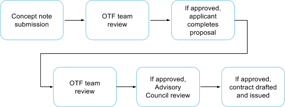
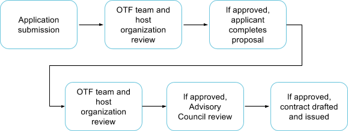
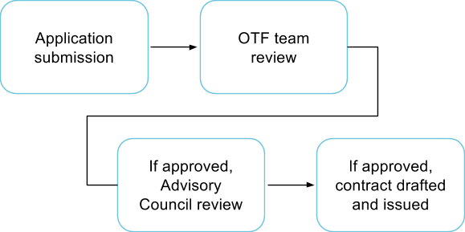

# Application Workflows

_From concept note to contract, depicted here is the process a successful application to OTF would take._

## _**For the funds supporting projects**_**:**

## _**For the funds supporting fellowships**_**:**

## _**For Rapid Response**_**:**

## For our Labs:

Application submission &gt; OTF team review &gt; If approved, contract drafted and issued

